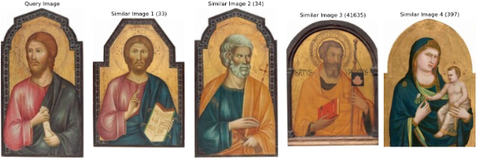
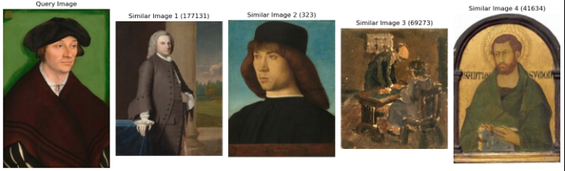
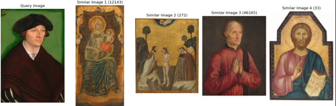
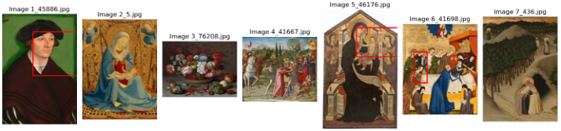

## Abstract
With the evolution of machine learning models, particularly in computer vision, AI models have demonstrated remarkable proficiency in capturing intricate style details, textures, and features of images. ***This task is dedicated to exploring image similarity by leveraging state-of-the-art pre-trained CNN models and innovative feature extraction techniques with the emphasis on the facial similarity***👨‍🦲

## 🔎Approach

### Data 
The dataset sourced from NationalGalleryOfArt/opendata encompasses diverse categories, including sculptures, physical objects, and paintings. Paintings were extracted from the dataset(objects_dimensions.csv) filtering the 'painted surface' category in the element column, resulting in 155 images. To ensure consistency in comparisons, a simple data pre-processing step was applied, resizing all images to (200,200) dimensions and normalizing them. Additional pre-processing such as flipping, rotation, or random cropping was avoided to preserve the integrity of the painting's composition. [[data_loader.py](utils/data_loader.py),[download_img.py](utils/download_img.py)] 

### Model
#### Feature Extraction 

Feature extraction is accomplished through the use of pre-trained CNN models such as VGG16 and ResNet50 trained on ImageNet. The final layers of these pre-trained models are truncated, retaining only the feature extraction components. Additionally, a specialized 'facial similarity-focused feature extraction' technique was implemented, employing face detection models to crop the facial area in each image. The pre-trained Multi-task Cascaded Convolutional Networks (MTCNN) from Facenet-pytorch were employed for rapid and accurate face detection, returning multiple bounding boxes of detected faces. The image is then cropped using the maximum bounding box encompassing all detected faces. [[extractor.py](modls/extractor.py)]

#### Similarity Assessment 
Following the extraction of both query image and gallery features, the similarity between images, particularly the painting style of faces if face_crop is set to True, is assessed by projecting extracted features into a manifold space and calculating the distance between given features to search for K nearest neighbours. The choice of 'cosine similarity' as the default metric is favored due to its suitability for high-dimensional data and its reflection of geometric similarity between vectors in the feature space, considering the angle between vectors.[[retrieve.py](utils/retrieve.py)]

## ✔Evaluation Metrics 
[[evaluation.py](utils/evaluation.py)]
Performance evaluation is conducted through both visual and quantitative means to provide a comprehensive assessment of the model's effectiveness. This dual approach ensures a well-rounded evaluation, providing both visual and numerical measures to assess the performance. 

**[1] Visualisation**

 The visual assessment involves showcasing the top K similar images with the highest distance score alongside the original image, offering an intuitive diagnosis of the model's understanding of image representations. 
 
 *Example : images/0.jpg  (Face_crop = False)*
 
  

**[2] Quantitative Score ($RMSE , SSIM$)**


$RMSE = sqrt(Σ((p - q)^2) / n)$
- $ p$ and $ q $ : pixel values of the two images being compared.
- $ n $ : total number of pixels in the images.


$SSIM = [(2 * μx * μy + c1) * (2 * σxy + c2)] / [(μx^2 + μy^2 + c1) * (σx^2 + σy^2 + c2)]$

- $ μx $and $ μy $ : average pixel values of images 
- $ σx^2 $ and $ σy^2$ : variances of images
- $ σxy $ : covariance of images 
- $c1$ and $ c2 $ : constants used to stabilize the division with weak denominators.

Quantitative evaluation entails calculating Root Mean Square Error (RMSE) and Structural Similarity Index (SSIM).
RMSE computes the pixel-wise difference between images, with scores ranging from -1 to 1, indicating higher similarity as the score approaches 1. 
SSIM moves a window over the image to capture structural similarities, encompassing luminance, contrast, and structural components. Both scores are averaged after considering the K number of similar images, and the query image's RMSE and SSIM scores are calculated, providing a balanced assessment of the model's performance in pixel-wise and structural similarity analyses.


## 👀 Results Analysis

In assessing the overall performance of the model, I conducted tests on a subset of the dataset, comprising 30 images, which accounts for 20% of the total dataset. The evaluation metrics utilized were average Structural Similarity Index (SSIM) and Root Mean Squared Error (RMSE). A notable observation emerged from this analysis: the disparity between the feature extraction models that applied facial cropping and those that utilized general feature vectors from the original model was negligible. This suggests that the face detection model may not be accurately isolating facial features from the paintings, potentially due to erroneous face detection or misidentification of facial regions.

| Compressor  | Average SSIM Score |  Average RMSE Score| 
|---------|----------|---------|  
|resnet_face       |        0.174401     |       0.277435|
|resnet_general      |      0.170127       |     0.277642|
|vgg_face            |      0.171231        |    0.261491|
|vgg_general          |     0.174376         |   0.260189|

The computed average RMSE score approached 0.3, while the average SSIM score hovered around 0.2. These scores signify a degree of similarity between the query image and the retrieved images, albeit with room for improvement.

**Facial Similarity Focused Feature Extraction vs. General Feature Extraction:**

 *Example : images/45886.jpg  (Face_crop = True)*
 
  
  
  *Example : images/45886.jpg  (Face_crop = False)
  
  

Visual inspection revealed that images portraying human-like faces with distinct 3D features retrieved similar images bearing resemblances in facial characteristics, such as nose shape and eye placement. However, the general similarity model without face cropping appears to prioritize the overall structure of the painting and superficial features, such as texture and color. This comparison underscores the successful capture of facial similarities across different paintings if the face detection is done successfully.

### 🔨**Possible Improvements**

- Enhanced Image Processing 

To enhance facial similarity analysis, employing image processing techniques such as brightness and saturation adjustments prior to feature extraction could yield more accurate results.

- Improvement on Feature Extraction Models 

In addition to VGG16 and ResNet models, exploring alternative architectures such as CNNs, transformers, autoencoders, or U-Nets could facilitate more comprehensive extraction of hidden image features.

- Fine-Tuned Face Detection Model with Painting Dataset
 

As the example above shows, existing face detection model showed poor performance in scenarios where facial size was minimal or the boundary between facial features was indistinct. This limitation stems from the fact that pre-trained face detection models are typically trained on photographs of humans rather than 2D paintings. Consequently, fine-tuning these models using a painting dataset, accompanied by ground truth labels for facial regions, would likely improve performance and accuracy.

- ⭐ Discover hidden images of paintings

Identifying similarities between paintings depends on two key factors: extracting hidden features effectively and selecting suitable evaluation metrics. If this model serves as the foundation of a hidden image discovery system and is refined with multispectral data, along with evaluation using balanced metrics like SSIM and RMSE, it could lead to innovative performance. I am eager to utilize this model as the cornerstone for developing a robust hidden image discovery system, contributing to meaningful findings in art history and unveiling hidden images to the world.
 
 ---
 ## 💻 Implementation Guide
 
 Refer to this [notebook](tutorials.ipynb) for the general guideline.
 
1. Install Required Packages:
Ensure that you have the required packages installed by running:
```
 !pip install -r requirements.txt
```

2. Run the Main Script:
Execute the main script with appropriate argument.
```
!python main.py --compressor vgg --download --percent 100 --query_image_path "./data/images/0.jpg" --metric cosine
```
 
--compressor vgg: Specifies the compressor to use (in this case, 'vgg').

--download: Indicates to download necessary resources.

--percent 100: Specifies the percentage (100%) of datasets you want to use. (default 100)

--query_image_path "./data/images/0.jpg": Specifies the path to the query image.

--metric cosine: Specifies the similarity metric to be used (default 'cosine').


 


